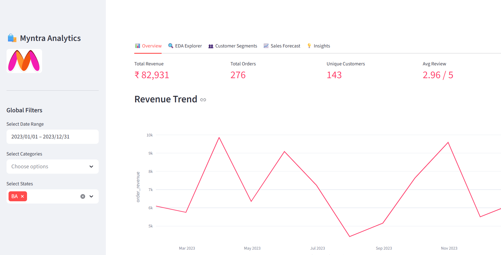
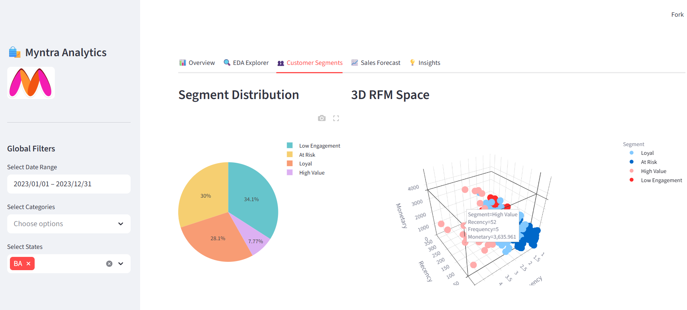
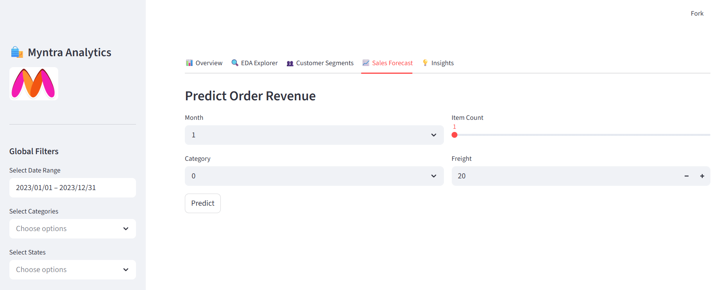

# 🛍️ Myntra-Inspired E-Commerce Analytics Hub
[](https://zqth4jpwwirzobmymim2x6.streamlit.app)
[](https://anal-model.vercel.app/)

A professional, end-to-end Data Science & Business Intelligence project. This hub transforms raw Brazilian e-commerce data (Olist) into actionable business strategies using Advanced Machine Learning and Customer Science.

---

## 📺 Project Walkthrough
### 1. Overview Dashboard

*Displays real-time KPIs including Total Revenue, Orders, and Average Review Scores. Includes global filters for Date and Category.*

### 2. Customer Segmentation (RFM)

*A 3D visualization of the Customer RFM space. Customers are automatically clustered into 4 personas: High Value, Loyal, At Risk, and Low Engagement.*

### 3. Sales Forecaster

*An interactive Machine Learning interface where users can input product parameters to predict the sale value of an order.*

---

## 📂 Project Structure
Built with a modular, scalable architecture inspired by industry standards:

```text
anal_Model/
├── data/
│   ├── raw/           # Original 9 Olist CSV datasets
│   └── processed/     # Cleaned and engineered Master DataFrames
├── src/
│   ├── config.py      # Global project settings and ML parameters
│   ├── data_merging.py# Relational join logic for 9 tables
│   ├── data_cleaning.py# Outlier treatment & null handling
│   ├── eda.py         # Generation of professional business charts
│   ├── segmentation.py# RFM computation & K-Means clustering
│   └── forecasting.py # Model training (LR, RF) & evaluation
├── models/            # Trained .pkl models and Scalers
├── outputs/
│   ├── figures/       # 11+ professional charts and dashboard captures
│   ├── dashboard/     # The live Streamlit application (app.py)
│   └── reports/       # Presentation guides & final summaries
└── requirements.txt   # Environment dependency list
```

---

## 🛠️ Step-by-Step Functionality

### Page 1: Overview 📊
*   **KPI Cards:** Instant view of the business health.
*   **Revenue Trend:** Time-series analysis to identify seasonality.
*   **Category Breakdown:** Visualizing which product groups drive the most value.

### Page 2: EDA Explorer 🔍
*   **Deep Dives:** Switch between 8 different views including Heatmaps and Correlation charts.
*   **Logistics Impact:** Analyzes how delivery delays negatively affect customer loyalty.

### Page 3: Customer Segments 👥
*   **Segment Logic:** Uses K-Means clustering on Recency, Frequency, and Monetary data.
*   **Focus Areas:** Highlighting 'At Risk' customers for prioritized marketing campaigns.

### Page 4: Sales Forecast 📈
*   **AI Predictor:** Uses a Random Forest Regressor to estimate order revenue.
*   **Inputs:** Accepts product weight, length, and predicted score.

---

## 🚀 How to Run Locally

1. **Clone the Repo:**
   ```bash
   git clone https://github.com/Amrit-raj50/anal_Model.git
   cd anal_Model
   ```

2. **Install Dependencies:**
   ```bash
   pip install -r requirements.txt
   ```

3. **Run the Dashboard:**
   ```bash
   streamlit run outputs/dashboard/app.py
   ```

---
